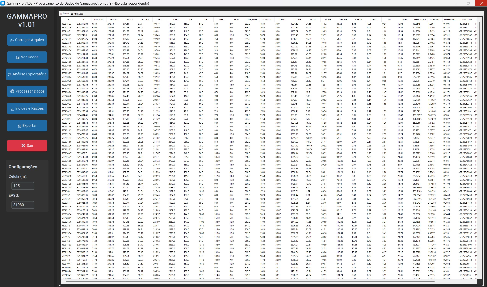
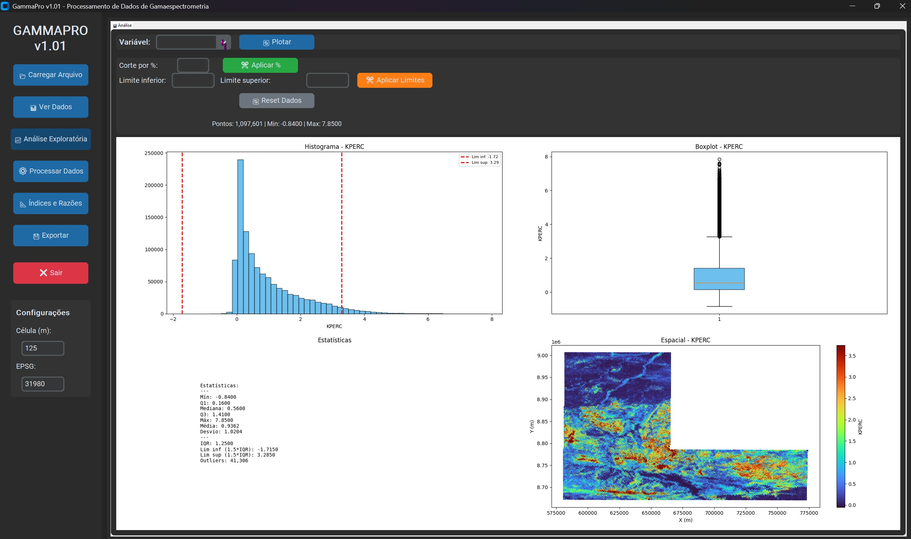
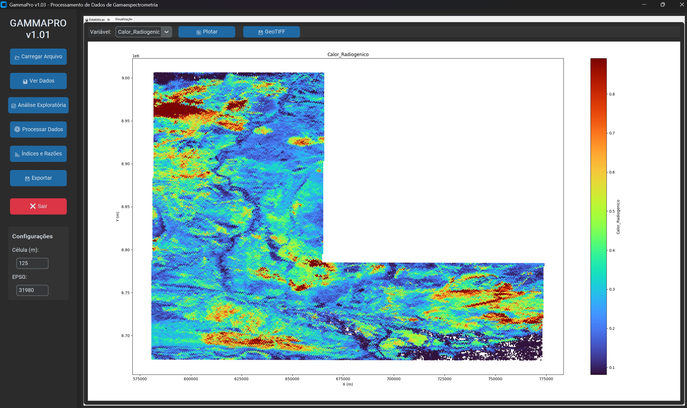

# GammaPro - Processamento de Dados de Gamaespectrometria

[](https://www.python.org/)
[](LICENSE)

Aplicação desktop moderna para processamento, análise e exportação de dados gammetricos.

## ✨ Funcionalidades

- 📂 **Carregar arquivos** - Suporte a arquivos .XYZ de dados gammetricos
- 📊 **Ver Dados** - Tabela de dados, atributos e mapa espacial interativo
- 📈 **Análise Exploratória** - Histograma, boxplot, estatísticas e distribuição espacial
- ⚙️ **Processar Dados** - Tratamento de valores negativos e sobre água
- 📐 **Índices e Razões** - Cálculo de:
  - Índice Laterítico (eTh / eU × K)
  - Calor Radiogênico
  - Fator f (eTh/eU)
  - Mapa Ternário RGB
  - eU, eTh, K Anômalos (z-score)
- 💾 **Exportação** - Múltiplos formatos:
  - CSV
  - Excel (.xlsx)
  - GeoTIFF (grids interpolados)
- 🎨 **Visualização** - Paleta de cores Turbo (valores baixos = azul/frio, altos = vermelho/quente)

## 📋 Requisitos

```
pandas>=1.5.0
numpy>=1.23.0
matplotlib>=3.6.0
seaborn>=0.12.0
scipy>=1.9.0
pyproj>=3.4.0
rasterio>=1.3.0
customtkinter>=5.1.0
Pillow>=9.3.0
openpyxl>=3.0.0
```

## 🚀 Instalação

1. Clone o repositório:
```bash
git clone https://github.com/cesarengminas/gamma-pro-app.git
cd gamma-pro-app
```

2. Instale as dependências:
```bash
pip install -r requirements.txt
```

## ▶️ Executar

```bash
python gammapro.py
```

Ou clique duas vezes em `run.bat` (Windows)

## 📁 Estrutura do Projeto

```
gamma-pro-app/
├── gammapro.py       # Aplicação principal
├── requirements.txt  # Dependências
├── README.md         # Este arquivo
├── run.bat           # Script para Windows
└── run_gammapro.py   # Script alternativo
```

## 📊 Interface

### Ver Dados

Visualização de dados em tabela, atributos estatísticos e mapa espacial interativo.

### Análise Exploratória

Análise exploratória com histogramas, boxplots, estatísticas e distribuição espacial.

### Índices e Razões

Visualização do Índice Laterítico, Calor Radiogênico, Fator f, Mapa Ternário e valores anômalos.

## 📝 Licença

MIT License

## Autor

César Ferreira
